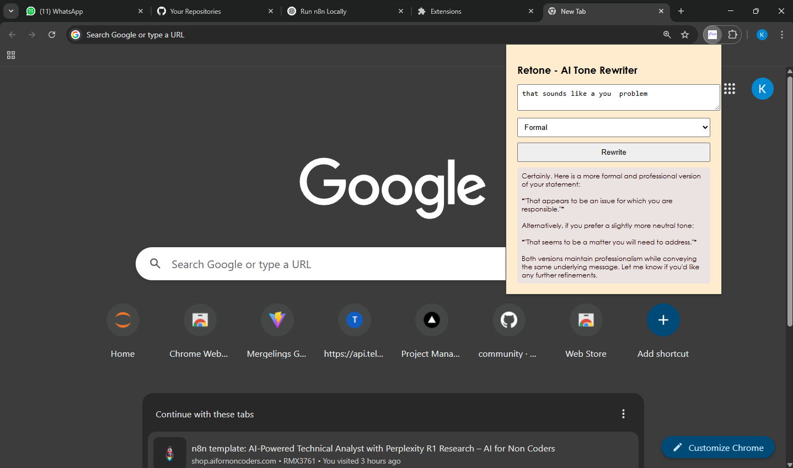

<b>## 📝 AI Tone Rewriter Chrome Extension<b>

**AI Tone Rewriter** is a Chrome extension that allows users to rewrite any text into a different tone — such as formal, casual, or friendly — using the **DeepSeek R1-0528 model via SambaNova Cloud**. The extension has a simple popup interface, and it communicates with a Python Flask backend to process the text using DeepSeek’s powerful language model.

---

### 🚀 Features

* 🔄 Rewrite any text in different tones (e.g., formal, casual, professional)
* 🧠 Powered by DeepSeek R1-0528 via SambaNova Cloud API
* ⚙️ Python Flask backend that connects securely to the API
* 🧩 Lightweight Chrome extension UI built with HTML, CSS, and JS
* 🔐 API key never exposed to frontend (handled in backend)

---

### 📸 Screenshot

> *(Add a screenshot or GIF of your popup UI here)*
> Example:
> 

---

### 📁 Folder Structure

```
ai-tone-rewriter/
├── extension/         # Chrome extension files
│   ├── manifest.json
│   ├── popup.html
│   ├── popup.js
│   └── styles.css
└── server/            # Python Flask backend
    └── app.py
```

---

### 🧩 How to Use

#### ✅ 1. Setup the Backend

```bash
cd server
pip install flask flask-cors openai
```

Edit `app.py` and either:

* Replace `SAMBA_API_KEY = "your-sambanova-api-key"`
  **OR**
* Set it in your terminal:

```bash
export SAMBA_API_KEY=your-real-api-key
```

Then start the server:

```bash
python app.py
```

Your Flask API will be running on:
`http://localhost:5000/rewrite`

---

#### ✅ 2. Load the Chrome Extension

1. Go to `chrome://extensions`
2. Enable **Developer Mode**
3. Click **Load unpacked** and select the `extension/` folder
4. Click the extension icon to open the popup
5. Enter text → choose tone → click **Rewrite**

---

### ⚙️ API Details (DeepSeek via SambaNova)

* **Endpoint**: `https://api.sambanova.ai/v1`
* **Model**: `DeepSeek-R1-0528`
* **Authentication**: Bearer token (`SAMBA_API_KEY`)
* Compatible with OpenAI Python SDK (`openai`)

---

### 💡 Example Prompt

**Input:**

> "Hey, just checking if you saw my message. Let me know!"

**Tone: Formal**

**Output:**

> "I hope this message finds you well. I wanted to follow up and inquire whether you had the opportunity to review my previous message."

---

### 🔒 Security Tips

* Never expose your API key in frontend code
* Keep `app.py` backend running locally or deploy securely to cloud (Render, Replit, etc.)

---

### 📚 Key Learnings

* How to integrate a Chrome extension with a Python backend
* How to use OpenAI-compatible SDKs with third-party model providers (SambaNova)
* Prompt engineering for tone transformation
* Secure backend API design with CORS

---

### 🛠️ Future Improvements

* Add rewrite history
* Support additional tones (humorous, assertive, empathetic)
* Deploy backend to cloud (Render, Railway, etc.)
* Auto-highlight rewritten differences

---

### ✒️Author

Made with ❤️ by Karishma Solanki
